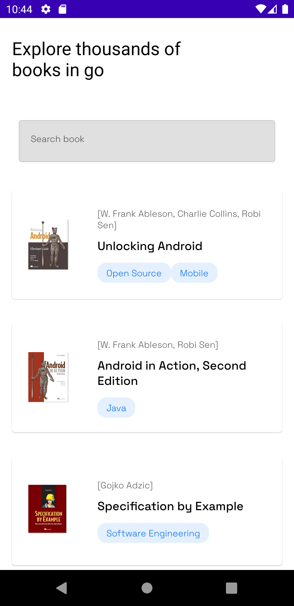
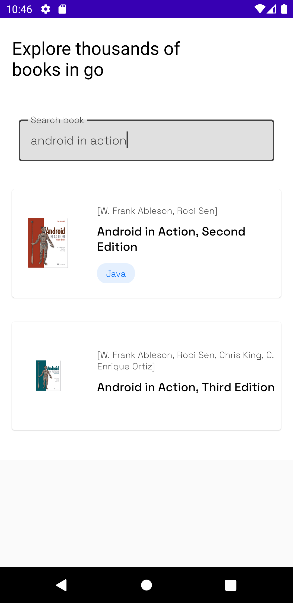
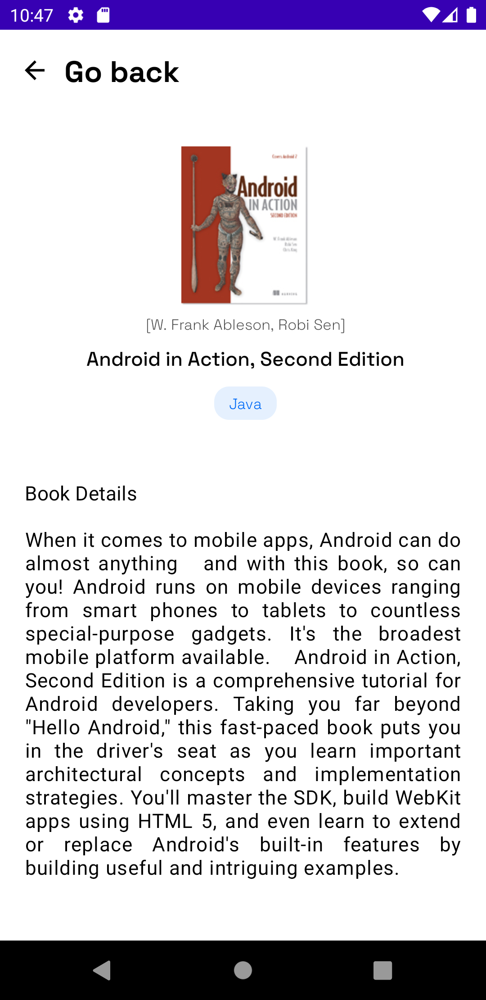

# 📜 Book Details App

This repository contains samples on jetpack compose for building different components like layouts, navigation, saving states and more.

App building with MVVM Architecture.
## Features
- Book Search and Details
- Multi-Screen Support
## Requirements
- Android Studio 
- Kotlin version 1.5.0 or later

## Getting Started

  1. Clone the repository to your local machine:

 ```bash
  git clone https://github.com/TriNguyen090102/BookDetailsApp.git
  ```
  2. Open the project in Android Studio
  3. Run the app on an emulator or physical device
  ## Dependencies
  - Jetpack Compose version 1.2.0 or later
  - Coil image loading library version 1.3.0 or later
  - Flow Layout version 0.14.0 or later

## What I've learned


1. Introduction to Jetpack Compose

2. UI/UX Design - Ideation process

3. MVVM Architecture

4. Dagger Hilt
5. Kotlin Serialization
6. Compose Navigation and much more...
## Screenshots
<div>
  
  
  
</div>

## Contact

If you have any questions or feedback, please contact me at minhtr090102@gmail.com


